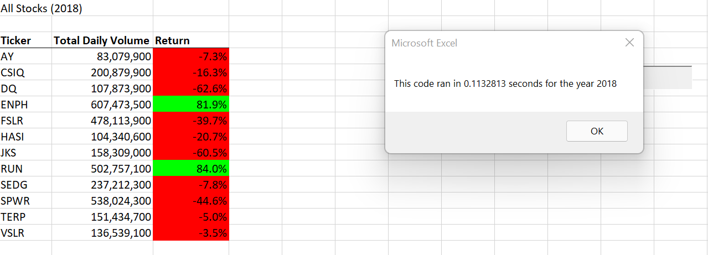

# VBA_StockAnalysis_Challenge

## Overview of Project

This project has been undertaken to help Steve understand which Green Energy stocks have done well in 2017 and 2018 and are worth investing in. We have calculated the total volume and returns on the basis of tickers. We had earlier written VBA codes to automate the calculation.The link has been provided for the original VBA script([https://github.com/Sukanya807/Stocks-Analysis-Practice](url)) For this project, we have refactored the same codes so that the entire stock market can be analyzed more efficiently and quickly.

## Results

In this project, we have refactored our codes and improved the logic so that the code runs more efficiently and is easy for future users to read. I have copied the original code written to perform the “All Stocks Analysis” that creates the headers, ticker array, total daily volume and returns. Then I have refactored parts of the code to make the calculations more efficient and quick. The below points include the refactored codes only.

***1.a)‘Creating tickerIndex variable and setting it to 0 to access the correct index across the four different arrays.***
```
tickerIndex = 0
```
   ***b)'Creating three output arrays. Arrays hold an arbitrary number of variables of the same type.We give the array a name and then access the individual variables by their index.***
   ```
Dim tickerVolumes(12) As Long
Dim tickerStartingPrices(12) As Single
Dim tickerEndingPrices(12) As Single
```
***2.a)‘Creating a loop to initialize tickerVolumes to zero.***
```
For i = 0 To 11
    tickerVolumes(i) = 0
    Next i
 
 ```
 ***b)‘Creating For Loop for all the rows.***
 ```
 For i = 2 To RowCount
 
 ```
 ***3.a)‘Increase volume for current ticker and add ticker volume for the current stock ticker.***
 ```
 tickerVolumes(tickerIndex) = tickerVolumes(tickerIndex) + Cells(i, 8).Value
 
 ```
 ***b)‘Check if the current row is the first row with the selected tickerIndex and assign the current starting price to the tickerStartingPrices variable.***
 ```
 If Cells(i - 1, 1).Value <> tickers(tickerIndex) And Cells(i, 1).Value = tickers(tickerIndex) Then
         tickerStartingPrices(tickerIndex) = Cells(i, 6).Value
            
        End If
```
***c)'check if the current row is the last row with the selected ticker and assign the current closing price to the tickerEnding Prices variable.***
```
If Cells(i + 1, 1).Value <> tickers(tickerIndex) And Cells(i, 1).Value = tickers(tickerIndex) Then
         tickerEndingPrices(tickerIndex) = Cells(i, 6).Value
         
         End If
 ```
 ***d)'Increase the tickerIndex if the next row’s ticker does not match the previous row’s ticker.***
 ```
 If Cells(i + 1, 1).Value <> tickers(tickerIndex) And Cells(i, 1).Value = tickers(tickerIndex) Then
            tickerIndex = tickerIndex + 1
            
            
        End If
    
    Next i
```
***4.a)'4.	Loop through your arrays to output the Ticker, Total Daily Volume, and Return.***
```
For i = 0 To 11
Worksheets("All Stocks Analysis").Activate
        Cells(4 + i, 1).Value = tickers(i)
        Cells(4 + i, 2).Value = tickerVolumes(i)
        Cells(4 + i, 3).Value = tickerEndingPrices(i) / tickerStartingPrices(i) - 1
        
        
    Next i
 
```

## Analysis

As a result of refactoring the above codes, the stock analysis for years 2017 and 2018 are being performed quickly. The screenshots attached below shows the difference.

##### 2017 Stock Analysis Before Refactoring


##### 2017 Stock Analysis After Refactoring


##### 2018 Stock Analysis Before Refactoring


##### 2018 Stock Analysis After Refactoring



## Summary

### A. Advantages and Disadvantages of Refactoring Code

Code Refactoring is a way of restructuring and optimizing existing code without changing its behaviour. It is a way to improve the code quality.

##### Advantages
* Clean codes are easier to update and improve
* Code refactoring reduces the likelihood of errors in the future and simplifies the implementation of new software functionality
* Clean codes are easier to understand for new developers
* It can help to find bugs and makes programming faster

##### Disadvantages
* Code refactoring can be time consuming
* There are higher chances of making mistakes when dealing with applications that are too large
* Not having the proper test cases for the existing codes may pose unwanted risk

#### B. How do these pros and cons apply to refactoring the original VBA script

#### Pros

The good part is that we do not need to start writing the script from scratch. We can copy the original script and refactor parts of it to see if it works. When done correctly, it can perform the tasks much more efficiently in much lesser time. We can also reuse this code on a larger dataset if required and could also avoid the nested loop.

#### Cons

If the original VBA code is stable and can accomplish the task at hand , it may not be worthwhile to spend time and money trying to refactor the code as it can further complicate the matter and lead to errors.
